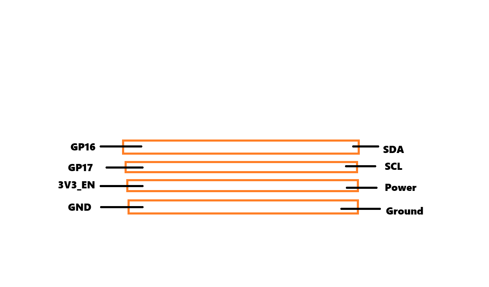

# Chu Pico - Chunithm Style Mini Controller
The original guide: https://github.com/whowechina/chu_pico
## Introduction
This guide is based on the chu_pico project, the only difference is that if you don't/want to build one with a PCB then this guide is for you 
**THIS GUIDE IS ADHD-PROOF AND IS VERY EASY TO FOLLOW, IF YOU MANAGE TO SCREW UP IT IS ON YOU.**
## Precautions
* **Some retards at Adafruit or whatever company that made the mpr121 PCB board decided that it's a good idea to pre-short the ground and the address,
so cut it off by making an insertion right here, with a knife or whatever pointy object you have.**
**CUT THE BLACK LINE DON'T CUT ANYONE ELSE. IF YOU DO IT IS DEAD.**

* **(A)** **Some retards at a Chinese company manufacturing the time of flight sensors didn't update the hardware address or have a faulty address that doesn't work with the Chu_Pico software (for some reason)
make sure to replace it or update the firmware (DON'T ACTUALLY UPDATE THE FIRMWARE, THAT IT'S IMPOSSIBLE FOR THE AVERAGE JOE.)**

## **WHAT YOU WILL NEED** (You could get these at Aliexpress or Amazon just type down the word)
* 3-PIN RGB LIGHTS WITH A DENSITY OF AROUND 1.12 INCHES A LED (optional) **If you don't want your controller to light up like a Christmas tree** 
* 3X MPR121 
* 5X VL53L0X **(THIS IS THE TIME OF FLIGHT SENSOR REFER TO (A) ABOVE**
* Raspberry Pi Pico **(Don't get the W version)**
* TCA9548A/PCA9548A **(THE SLASH MEAN GET ONE OF THESE NOT BOTH)**
* Aluminium Foil (Best to use Copper tape) 
* A Soldering Kit (optional) **(If you don't have one use tape or glue)**
* Tape
* Acrylic Sheet (optional) **The alternative is anything plastic and clear like a clear plastic bag**
* Cardboard (optional) **This is stretching it a bit but where are you going to place it**

## 1. Copper Tape lanes
You will have 4 copper/aluminum tape lanes, One is SDA, SCL, GND, and 3.3V power. Make sure they are not touching and label it or else your dementia ass brain will forget.
 
 
 
**Connect to your Raspberry Pi Pico:**
* **SDA TO GP16**.
* **SCL TO GP17** 
* **POWER TO 3V3_OUT** ***DON'T DO 3V3_EN***
* **GROUND TO GND** *(COULD BE ANY ACCORDING TO THE PINOUT)* 
* **HERE IS THE PINOUT DO IT ACCORDINGLY**

  
## 2.SOLDERING/TAPING/GLUING

